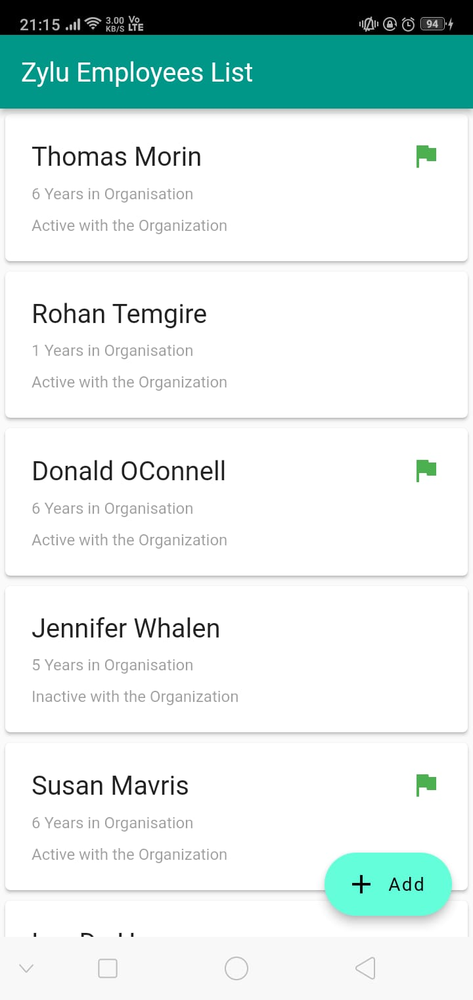
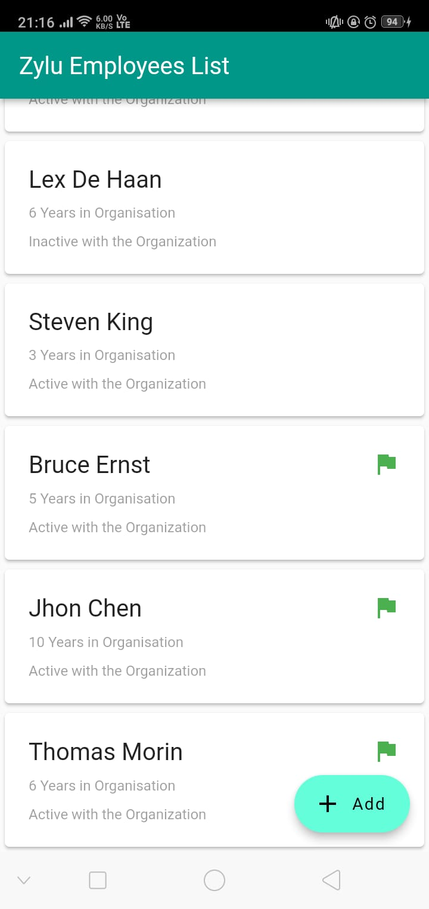
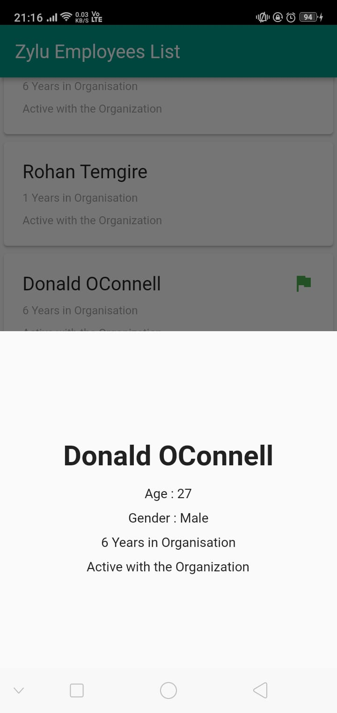
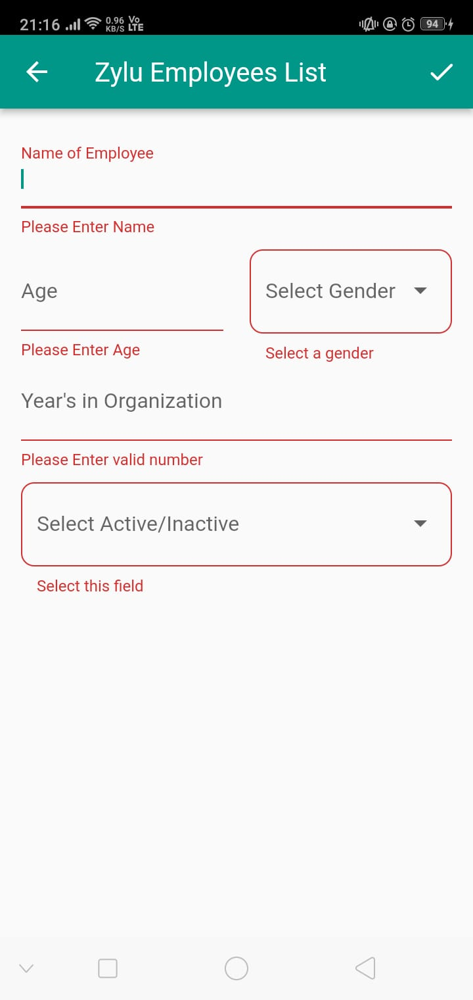
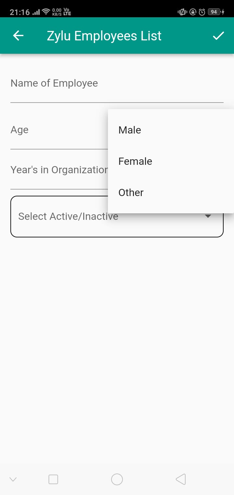
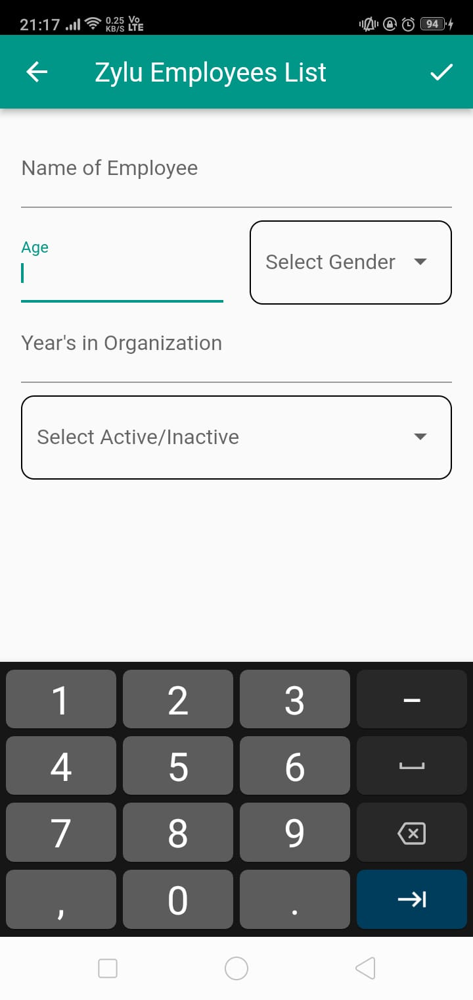

# Employee List Application

A new Flutter project.

A Flutter app to display all the employees. Any employee who is been more than 5 years and active with the organization have been flagged in green color. 

<h1>HomeScreen</h1>

<h1>Detail of the Employee</h1>

<h1>Adding an Employee</h1>

<h1>Application Demo</h1>
<video width="320" height="240" autoplay>
  <source src="./ScreenShots/video.mp4" type="video/mp4">
 
Your browser does not support the video tag.
</video>
